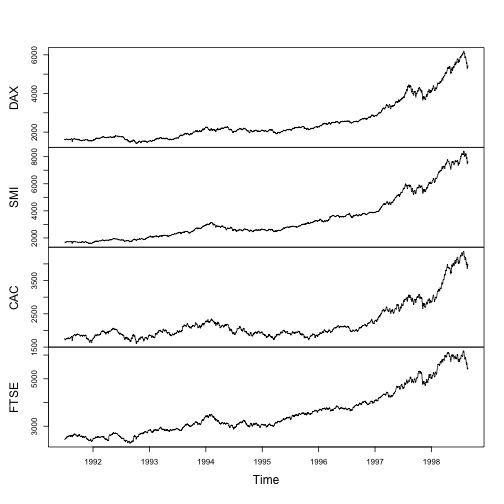

GARCH Models with EU Stock Market Data
========================================================
author: Richard M. Smith
date: June 13, 2015
css: custom.css

Overview
========================================================

Using the `EuStockMarkets` data in the **utils** package, we provide a method for running [GARCH](https://en.wikipedia.org/wiki/Autoregressive_conditional_heteroskedasticity#GARCH) models from the **tseries** package on windows of time for the 4 stock markets.

The application can be found on RStudio's shiny server [here]()

EU Stock Markets Data Summary
========================================================

Daily closing prices 1991-1998 for major European stock indices.
 

***

Basic Data Structure

```
 mts [1:1860, 1:4] 1629 1614 1607 1621 1618 ...
 - attr(*, "dimnames")=List of 2
  ..$ : NULL
  ..$ : chr [1:4] "DAX" "SMI" "CAC" "FTSE"
 - attr(*, "tsp")= num [1:3] 1991 1999 260
 - attr(*, "class")= chr [1:3] "mts" "ts" "matrix"
```


Application Overview
========================================================

1. First pick the date range you want to examine.
  - First choose a year and month, then a specific date
  - Click outside the date picker to close the window
2. Choose which of the 4 European markets you would like to examine

The plot will automatically update with the black line representing the actual series and a dotted red line showing a GARCH model using `predict.garch` from the **[tseries](http://cran.r-project.org/web/packages/tseries/tseries.pdf)** package.

Notes
========================================================

- Due to the nature of using `window`, the plots render only full months regardless of the specific date picked.
- Indices:
  - DAX: Germany
  - SMI: Switzerland
  - CAC: France
  - FTSE: UK
